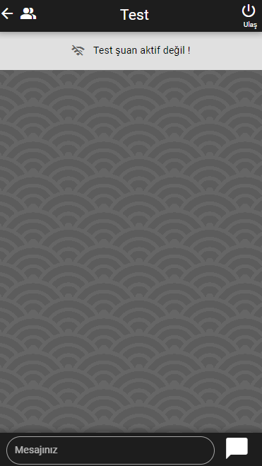

# Chat App (chatapp-vue)

Yapılanlar , Planlananlar:

- [x] Sayfaların route ayarı yapıldı
- [x] Kullanıclar sayfası tasarlandı
- [x] Mesaj sayfası tasarlandı
- [x] Login ve register sayfası oluşturuldu tasarlandı
- [x] Login ve register sayfası componenti tasarlandı
- [x] Firebase projeye eklendi, config yapıldı
- [x] Fire base db tasarımı yapıldı
- [x] Login ve register (auth) işlemleri yapıldı
- [x] Kullanıcı state e eklendi,
- [x] Kullanıcının login olup olmama durumuna göre state güncellendi
- [x] Kullanıcının online olup olmadığını real time olarak db ye yazdırıldı
- [x] Kullanıclar sayfası data base ile ilişkilendirildi
- [x] Kullanıcı mesajları dinamik olarak databaseden çekildi
- [x] Kullanıcı nin verileri mesaj bölümüne aktrıldı
- [x] Kullanıcının online olup olmadığını gösteren panel dinamik yapıldı
- [x] Kullanıcılar arası dinamik mesajlaşma yapıldı !!!!!
- [x] Mesaj scroll yapıldı
- [x] Mesaj arka plan güncelleştirildi
- [x] Vercel Deploy alindi proje tamamlandı

## Ekran Görüntüleri





## Install the dependencies

```bash
npm install
```

### Start the app in development mode (hot-code reloading, error reporting, etc.)

```bash
quasar dev
```

### Build the app for production

```bash
quasar build
```

### Customize the configuration

See [Configuring quasar.conf.js](https://v2.quasar.dev/quasar-cli/quasar-conf-js).
